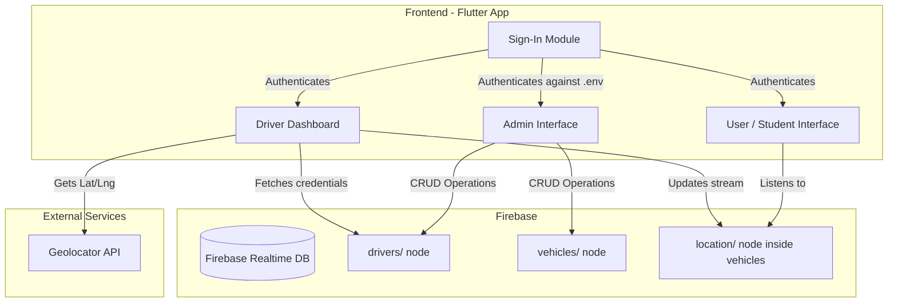
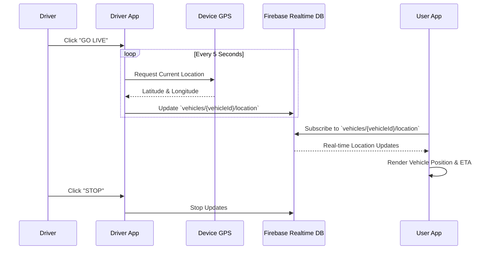

# Real-Time Vehicle Tracking System

A comprehensive Flutter-based real-time vehicle tracking application designed to cater to three primary roles: Users (Students), Drivers, and Administrators. This system leverages Firebase Realtime Database for live location updates and Geolocator for precise GPS tracking.

## 🚀 Features

- **Role-Based Access Control**: Secure login system distinguishing between Administrators, Drivers, and Users (Students).
- **Live Location Tracking**: Drivers can broadcast their real-time GPS coordinates, which are instantly reflected for users tracking their vehicles.
- **Admin Dashboard**: Administrators can easily manage vehicles, assign drivers, and add boarding points.
- **Driver Dashboard**: Drivers are provided with a dedicated interface indicating their assigned vehicle and the ability to toggle live location broadcasting, complete with an SOS feature.
- **ETA Calculation**: Users can view estimated time of arrival based on the current location of the vehicle.

## 🛠 Tech Stack

- **Frontend**: Flutter (Dart)
- **Backend**: Firebase Realtime Database
- **Location Services**: Geolocator (GPS)
- **Environment Management**: `flutter_dotenv`

## 🏗 Architecture Diagram



## 🔄 Flow Diagrams

### Authentication Flow

```mermaid
sequenceDiagram
    participant User
    participant App as Flutter App
    participant Env as .env Configuration
    participant Firebase as Firebase DB

    User->>App: Enter ID, Password, and Role
    App->>App: Validate Inputs
    
    alt Role == Student / Admin
        App->>Env: Check against STUDENT_ID/ADMIN_ID
        alt Match
            App->>User: Grant Access (Home / Admin Page)
        else No Match
            App->>User: Show Invalid Credentials Error
        end
    else Role == Driver
        App->>Firebase: Fetch driver details (drivers/{id})
        Firebase-->>App: Return Driver Data
        alt Match Password && Has Assigned Vehicle
            App->>User: Grant Access (Driver Dashboard)
        else Error
            App->>User: Show Error (Invalid Password / No Vehicle)
        end
    end
```


### Live Tracking Flow


## ⚙️ Getting Started

### Prerequisites
- Flutter SDK (`>=3.3.1 <4.0.0`)
- Android Studio / VS Code
- Firebase Project configured and `google-services.json` / `GoogleService-Info.plist` added.

### Installation

1. **Clone the repository**
   ```bash
   git clone <repository_url>
   cd Real-Time-Vehicle-Tracking-System
   ```

2. **Install dependencies**
   ```bash
   flutter pub get
   ```

3. **Configure Environment Variables**
   Create a `.env` file in the root directory based on `.env.example`:
   ```env
   STUDENT_ID=your_student_id
   STUDENT_PASSWORD=your_student_password
   ADMIN_ID=your_admin_id
   ADMIN_PASSWORD=your_admin_password
   ```

4. **Run the App**
   ```bash
   flutter run
   ```

## 📁 Key Directories

- `lib/adminPages/`: Features mapping to Admin capabilities (add drivers, vehicles, boarding points).
- `lib/driverPages/`: Dedicated UI for drivers including the location transmission logic.
- `lib/userPages/`: UI for actual end-users (students) tracking the vehicles.
- `lib/services/`: Reusable services like custom `AppLogger` for structured logging.
- `lib/firebase.dart`: Core wrapper around Firebase SDK to handle ETA and static location fetches.

---

## 🌟 Meet the Team

A dedicated team of developers who built and brought this Real-Time Tracking System to life:

| Contributor | GitHub Profile |
| :--- | :--- |
| **Anupam Singh** *(Lead)* | [@anupam9919](https://github.com/anupam9919) | 
| **Abhishek Srivastav** | [@srivastavabhishek936](https://github.com/srivastavabhishek936) |
| **Kaushiki Srivastava** | [@Kaushh21](https://github.com/Kaushh21) |
| **Kanchi Gupta** | [@KanchiGupta183](https://github.com/KanchiGupta183) |
