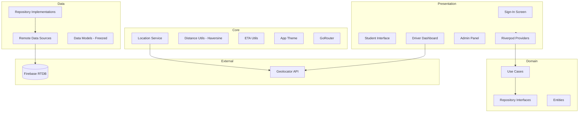
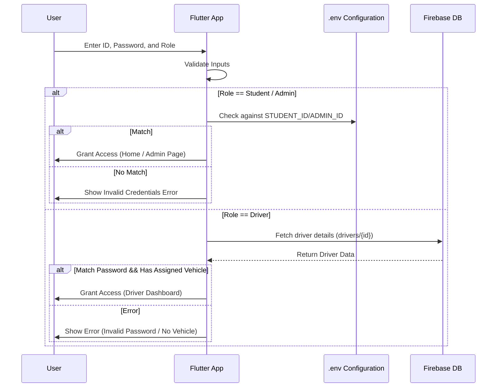
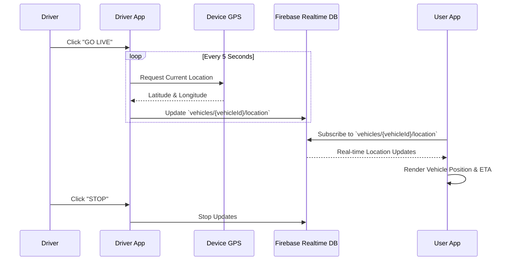

# Real-Time Vehicle Tracking System

A comprehensive Flutter-based real-time vehicle tracking application designed to cater to three primary roles: Users (Students), Drivers, and Administrators. This system leverages Firebase Realtime Database for live location updates and Geolocator for precise GPS tracking.

## 🚀 Features

- **Role-Based Access Control**: Secure login system distinguishing between Administrators, Drivers, and Users (Students).
- **Live Location Tracking**: Drivers broadcast real-time GPS coordinates (every 5 seconds), instantly reflected for users tracking vehicles.
- **ETA & Distance Calculation**: Real-time ETA computed using live GPS speed and straight-line distance (Vincenty formula via Geolocator).
- **Nearest Bus Stop Finder**: Automatically detects user's location and finds the closest boarding point with walking ETA.
- **Admin Dashboard**: Full CRUD for vehicles, drivers, and boarding points.
- **Driver Dashboard**: Dedicated interface with live GPS transmission toggle, speed display, and SOS emergency button.
- **Premium Glassmorphic UI**: Dark-themed, frosted-glass design with smooth animations powered by Flutter Animate.
- **CI/CD Pipeline**: Automated APK builds and GitHub Releases via GitHub Actions on version tags.

## 🛠 Tech Stack

| Layer | Technology |
| :--- | :--- |
| **Framework** | Flutter (Dart SDK `≥3.3.1 <4.0.0`) |
| **Backend** | Firebase Realtime Database |
| **Authentication** | Firebase Auth |
| **State Management** | Riverpod (`flutter_riverpod`) |
| **Routing** | GoRouter (`go_router`) |
| **Location / GPS** | Geolocator |
| **Code Generation** | Freezed + JSON Serializable |
| **UI / Design** | Google Fonts, Flutter Animate, Timeline Tile |
| **Logging** | Dart `logging` package with custom `AppLogger` |
| **CI/CD** | GitHub Actions (automated APK build + release) |

## 🏗 Architecture

The project follows a **Clean Architecture** pattern with feature-based modules:



## 🔄 Flow Diagrams

### Authentication Flow


### Live Tracking Flow


## ⚙️ Getting Started

### Prerequisites
- Flutter SDK (`>=3.3.1 <4.0.0`)
- Android Studio / VS Code
- Firebase Project configured and `google-services.json` / `GoogleService-Info.plist` added.

### Installation

1. **Clone the repository**
   ```bash
   git clone https://github.com/anupam9919/Real-Time-Vehicle-Tracking-System.git
   cd Real-Time-Vehicle-Tracking-System
   ```

2. **Install dependencies**
   ```bash
   flutter pub get
   ```

3. **Configure Environment Variables**
   Create a `.env` file in the root directory based on `.env.example`:
   ```env
   STUDENT_ID=your_student_id
   STUDENT_PASSWORD=your_student_password
   ADMIN_ID=your_admin_id
   ADMIN_PASSWORD=your_admin_password
   ```

4. **Run the App**
   ```bash
   flutter run
   ```

## 📁 Project Structure

```
lib/
├── core/                   # Shared utilities, theme, services, constants
│   ├── constants/          # Firebase path constants
│   ├── errors/             # Custom exceptions and failure classes
│   ├── services/           # Location service (GPS abstraction)
│   ├── theme/              # App colors and theme data
│   └── utils/              # Distance (Haversine) and ETA utilities
├── features/
│   ├── auth/               # Authentication (data → domain → presentation)
│   └── tracking/           # Vehicle tracking (data → domain → presentation)
├── routing/                # GoRouter configuration with auth guards
├── config/                 # Environment configuration
├── components/             # Shared UI widgets (Bus Stop finder)
├── adminPages/             # Admin screens (manage vehicles, drivers, boarding points)
├── driverPages/            # Driver dashboard with live GPS transmission
├── userPages/              # Student screens (home, track, search, account)
├── services/               # App-wide services (structured logger)
└── main.dart               # App entry point
```

---